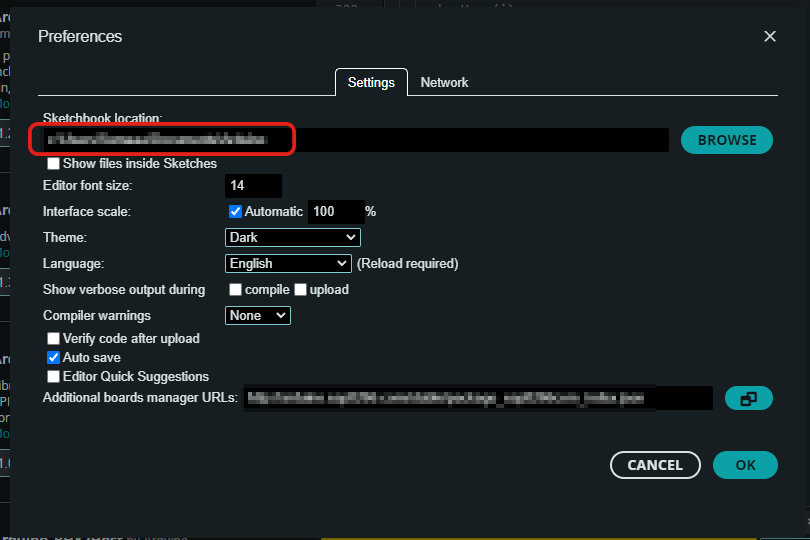
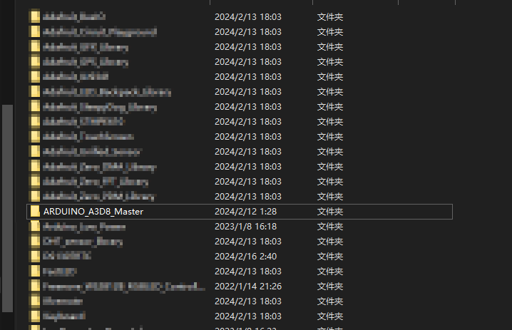
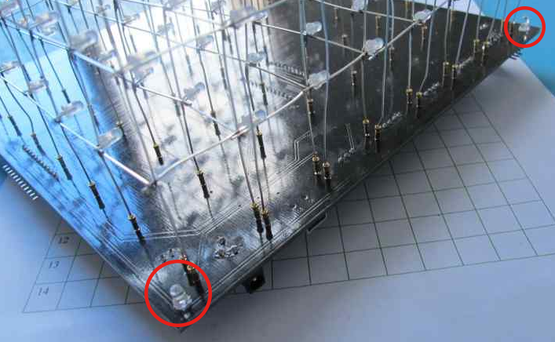
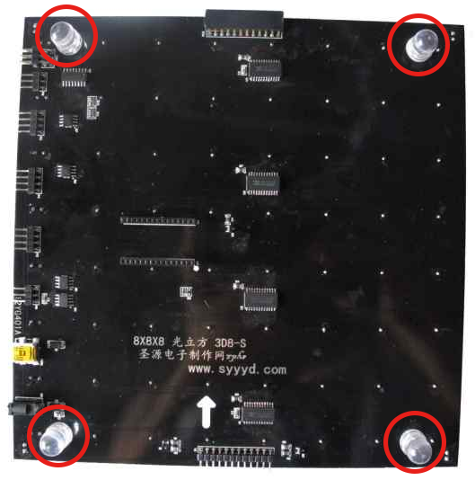
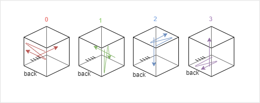
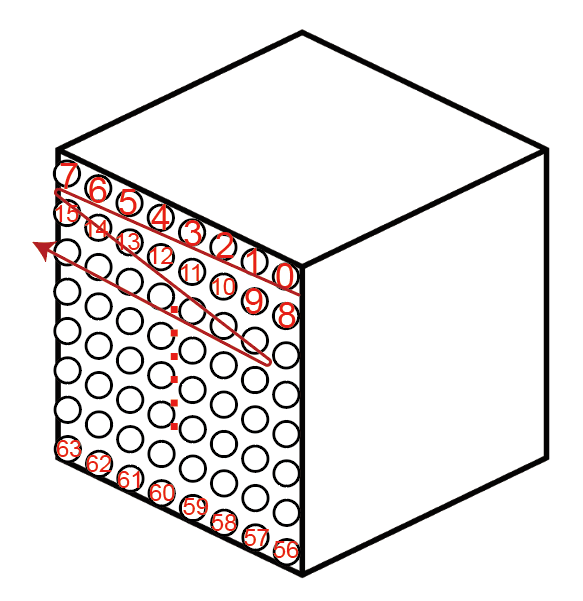
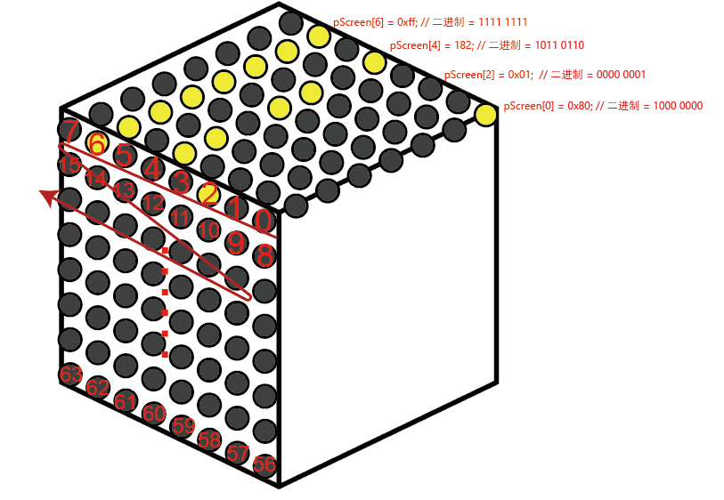

# ShengYuan3D8S_Arduino_Note
个人笔记，非官方，总结通过Arduino控制圣源3D8S的方法。淘宝店铺并没有提供该库的细节用法档案，此作为个人制作中的经验总结。
<!-- TOC -->
* [搭建](#搭建)
* [安装库](#安装库)
* [引脚连接](#引脚连接)
* [代码详解](#代码详解)
  * [初始化设置](#初始化设置)
  * [底灯控制](#底灯控制)
  * [基本发送逻辑](#基本发送逻辑)
  * [全局发送：亮度](#全局发送亮度)
  * [全局发送：点亮](#全局发送点亮)
  * [※ 个别控制](#-个别控制)
* [TODO](#todo)
<!-- TOC -->
# 搭建

3D8S的搭建方法等，见[官网](https://syyyd.com/forum.php?mod=forumdisplay&fid=113&page=1)，
[淘宝购买链接](https://m.tb.cn/h.5tAUiKp?tk=p8SqWkoLCpj)。

# 安装库
1. 在Arduino Ide 界面，File > Preference （或Ctrl+;）打开首选项界面
2. 复制在首选项中的Sketchbook location的文件地址。\

3. 在文件管理器中打开该地址，双击进入libraries这里是Arduino保存库文件的位置。
4. 下载该Repository，复制其中的`ARDUINO_A3D8_Master` 这个文件夹到libraries中。或复制淘宝店家发来的文件中的`ARDUINO_A3D8_Maste` 这个文件夹到libraries中。\

5. 在Arduino主页面（代码编辑页面）File > Examples 中看到`ARDUINO_A3D8_Master` 或 Sketch > Include Library看到`ARDUINO_A3D8_Master`，说明安装成功了。

# 引脚连接

P2.1 -> VCC (5V)\
P2.2 -> #1 (TX)\
P2.3 -> #0 (RX)\
P2.4 -> GND (0V)

# 代码详解
通过`ARDUINO_A3D8_Master`库中的A3D8_Basic示例文件和实验掌握进行功能的推测。
## 初始化设置

不需要完全理解，直接复制到自己的文件中就行了，***若要直接复制，复制本段最后的总结代码就行。***
 - 头部，在setup()之外，
 ```cpp
// 加载库
#include "Controller_A3D8_Basic.h"
// 创建串口对象，用于之后告诉Controller_A3D8_Basic库用硬串口发送数据到A3D8 LED矩阵
extern HardwareSerial Serial;
// LED的数量为8x8x8，改库通过长度为64个byte的数组pScreen传输数据
const byte length = 64;
// 声明一个指向byte类型的指针pScreen，用于后续数据传输
byte * pScreen;
// 创建名为cube的对象
Controller_A3D8_Basic cube(Serial);
```

在setup中，需要包括以下代码

```cpp
void setup()
{
	// 指定pScreen为length长度的数组
	pScreen = new byte(length);
	// 开启串口，串口速率必须为57600
	Serial.begin(57600);
}
```

在setup中，可以包括以下代码，这两句代码将会打开点亮所有的LED

```cpp
cube.sendMode(Controller_A3D8_Basic::XYZ);
cube.sendBrightness(0xff);
```

相反，可以通过以下代码关闭所有LED

```cpp
cube.sendMode(Controller_A3D8_Basic::XYZ);
cube.sendBrightness(0x00);
```

总结下来，***所有的初始化代码就是***，直接复制就行

```cpp
#include "Controller_A3D8_Basic.h"
extern HardwareSerial Serial;
const byte length = 64;
byte * pScreen;
Controller_A3D8_Basic cube(Serial);

void setup()
{
	pScreen = new byte(length);
	Serial.begin(57600);
	// ------------可选，关闭所有LED--------------
	cube.sendMode(Controller_A3D8_Basic::XYZ);
	cube.sendBrightness(0x00);
	// ------------------------------------------
}
```


之后的`cube`都遵循上面的`Controller_A3D8_Basic cube(Serial);`创建的A3D8对象，pScreen都遵循上面`pScreen = new byte(length);`
## 底灯控制
```cpp
cube.sendBgLed(数据)
```

**数据**：byte类型，必须为0~3，超过则无效

| 数据 | 底板上侧小灯 | 底板下侧大灯 |
| --- | --- | --- |
| 0 | ❌ | ❌ |
| 1 | ✔ | ❌ |
| 2 | ❌ | ✔ |
| 3 | ✔ | ✔ |

❌：关闭，✔：打开

\
底板上侧小灯

\
底板下侧大灯

## 基本发送逻辑

***先通过`cube.sendMode`告诉A3D8传输的模式，再通过`cube.sendBrightness`、`cube.sendGlobal`或`cube.sendBatch`，发送具体的数据。*** 

***发送一次模式A3D8就会一直持续以该模式接收数据，不用每次发送数据前都发送模式。***

## 全局发送：亮度

按亮度点亮所有LED。

```cpp
// 全局发送模式
cube.sendMode(Controller_A3D8_Basic::XYZ);
// 发送亮度数据
cube.sendBrightness(**亮度**);
```

**亮度**：byte数据类型，`0x00`~ `0xFF` ，完全关闭~完全点亮所有的LED。

## 全局发送：点亮

```cpp
// 全局发送模式
cube.sendMode(Controller_A3D8_Basic::XYZ);
// 发送LED控制数据
cube.sendGlobal(**数据**);
```

**数据**：byte数据类型，`0x00` ~ `0xFF` ，***按传入的byte数据的二进制点亮LED***。通常只使用`0x00`全部关闭和`0xFF`全部开启。

其他的数据，举例就是：

| 16进制 | 2进制 |  |
| --- | --- | --- |
| 0x01 | 00000001 | 点亮第1的LED |
| 0xFF | 11111111 | 点亮所有的LED |
| 0xD4 | 11010100 | 点亮第1、2、4、6的LED |

**TODO**：会以哪个方向为基准？
## ※ 个别控制

***通过pScreen数组的地址指定对哪一行（列）的8个LED灯，通过赋值的byte数据的二进制模式决定开启（1）或关闭（0）LED。***

```cpp
// 发送个别控制的模式
cube.sendMode((Controller_A3D8_Basic::InputMode)模式);
// 对pScreen对象做出修改
// 以下是修改的示例：
pScreen[23] = 0x04; 
pScreen[24] |= 0x04; 
pScreen[25] >> 1; 
// 发送数据
cube.sendBatch(pScreen, length);
```

Controller_A3D8_Basic::InputMode枚举共有四种分别的模式，分别对应了三个LED矩阵的三个映射方向：

```cpp
cube.sendMode((Controller_A3D8_Basic::InputMode)0);
cube.sendMode((Controller_A3D8_Basic::InputMode)1);
cube.sendMode((Controller_A3D8_Basic::InputMode)2);
cube.sendMode((Controller_A3D8_Basic::InputMode)3);
```

超过`3`的`sendMode` 将会无效，务必在传参时确认参数在0～3之间。

我在这定义，有电源插口和链接Arduino链接杜邦头的一边为背面，从上往下看，顺时针顺序的下一个边应该有一排杜邦公引脚。

如此定义下，四个模式的示意图如下：\


直线代表通过byte控制的LED的方向，曲线是映射LED列的`pScreen`地址从低到高的顺序，

方便理解，作为示例，比如在`(Controller_A3D8_Basic::InputMode)0` 下，这个曲线所表明的`pScreen` 的地址映射是：\


在这个模式下，若我们执行，对最上排的地址为0、2、4、6的四个地址的LED列进行修改，和发送数据，最上排的LED会根据对地址传入的byte数据的二进制状态进行点亮，如下\

```cpp
cube.sendMode((Controller_A3D8_Basic::InputMode)模式);

pScreen[0] = 0x80; // 二进制 = 1000 0000 
pScreen[2] = 0x01;  // 二进制 = 0000 0001
pScreen[4] = 182; // 二进制 = 1011 0110
pScreen[6] = 0xff; // 二进制 = 1111 1111

cube.sendBatch(pScreen, length);
```
它将会以下图方式点亮：\


# TODO

- [ ]  软串口是否也可以用于传输数据？
- [ ]  `cube.sendBrightness` 的具体用法
